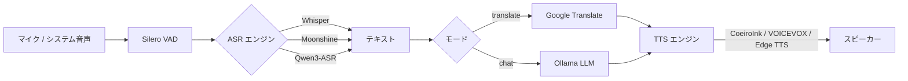

## この記事のゴール

リアルタイム音声翻訳と AI 音声チャットを 1 本で兼ねるローカルアプリ **[Voice Bridge](https://github.com/zephel01/voice-bridge)** を、v4.0.0 時点の機能ベースで紹介します。

**一番の売りは、Google 翻訳や Edge TTS のような合成音声ではなく、「自分が聞きたい声」で翻訳やチャットを受けられること。** VOICEVOX のずんだもん、CoeiroInk のリリンちゃん ── 推しキャラの声で英語 YouTube が日本語化されたり、AI がマイク越しに話し返してくる、という体験を軸に設計しています。

- 🎤 **ずんだもん / 四国めたん等（VOICEVOX）** と **リリンちゃん等（CoeiroInk）** で翻訳・チャット読み上げ
- 🌍 **翻訳モード**: YouTube など PC で鳴っている英語音声を、推しキャラの日本語音声に変換して聞く
- 💬 **チャットモード**: マイクで話しかけると、ずんだもん／リリンちゃんが**ローカル LLM** の応答を読み上げて返す
- 🦙 **ローカル完結**: Ollama + Qwen3-ASR + VOICEVOX / CoeiroInk で外部 API に下書きも音声も流さない
- 🆕 **v4 新要素**: Qwen3-ASR 統合・言語自動検出・TTS フィードバックループ防止・レイテンシ計測

:::message
本記事は Voice Bridge **v4.0.0** の README と `docs/reference/ARCHITECTURE.md` を元に書いています。実装詳細や最新コマンドはリポジトリ側を必ず確認してください。
:::

## Voice Bridge は何をするアプリか

Voice Bridge は「PC のシステム音声 or マイク」を入力にして、**ASR → 翻訳 or LLM → TTS** を繋ぐリアルタイム音声パイプラインです。

| モード | 入力 | 処理 | 出力 | 想定シーン |
| --- | --- | --- | --- | --- |
| 🌍 **翻訳モード** | システム音声 / マイク | ASR → Google 翻訳 → TTS | 翻訳済みの音声 | YouTube の英語動画を日本語音声で視聴、国際会議のリアルタイム翻訳 |
| 💬 **チャットモード** | マイク | VAD → ASR → ローカル LLM → TTS | AI の音声応答 | ずんだもん／リリンちゃんと雑談、音声で AI に質問・指示 |

GUI は tkinter で、モード・ASR エンジン・LLM・TTS・チャンク長をドロップダウン／スライダーでリアルタイムに切り替えられます。

https://github.com/zephel01/voice-bridge

## 🎤 一番の売り：推しキャラの声で翻訳・チャットする

Voice Bridge を作った一番のモチベーションはここです。

**Google 翻訳の合成音声や Edge TTS の無機質なナレーターで英語動画を聴き続けるのがしんどい。** あの「がんばって読み上げてます」感のある声に 30 分付き合うくらいなら、字幕で読んだ方がマシ、となる。でも字幕は字幕で画面に視線を固定するし、料理中や手元作業中には使えない。

そこで「読み上げ部分だけ、自分が聞きたい声に差し替えられるなら話が変わるのでは？」という発想で、TTS 層を **VOICEVOX / CoeiroInk** に差し替えられるようにしました。これが効いて、

- 英語 YouTube をずんだもんの声で聴く
- AI への質問の返答をリリンちゃんの声で聴く
- 技術ドキュメントの英語ページを四国めたんに読ませる

みたいな、**「内容はまじめ、声は推し」** という体験が成立します。

### 対応している TTS（v4 時点）

| エンジン | 代表キャラ | 起動方法 | 特徴 |
| --- | --- | --- | --- |
| 🫛 **[VOICEVOX](https://voicevox.hiroshiba.jp/)** | ずんだもん / 四国めたん / 春日部つむぎ 等 | VOICEVOX アプリを起動しておく（ローカル） | 完全ローカル・商用利用も規約範囲で可・キャラ多数 |
| 🌸 **[CoeiroInk](https://coeiroink.com/)** | リリンちゃん 等 | CoeiroInk アプリを起動しておく（ローカル） | 表現力豊か・リリンちゃんが看板・日本語特化 |
| 🌐 Edge TTS | Microsoft の標準音声 | 何もしなくても動く | フォールバック用・ネット接続必要・7 言語対応 |

ポイントは、**VOICEVOX も CoeiroInk もローカルアプリ**という点です。デスクトップアプリとして動いている合成エンジンに Voice Bridge が HTTP で喋りかけるだけなので、音声データがクラウドに流れません。「下書きも雑談もローカルで完結させたい」派にちょうど良いはず。

### 起動フラグで切り替える

CLI からはフラグ一発で切り替わります。

```bash
# ずんだもん（VOICEVOX）で英語 YouTube を翻訳
python main.py --mode translate --voicevox \
  --source-lang en --target-lang ja

# リリンちゃん（CoeiroInk）で AI チャット
python main.py --mode chat --vad --coeiroink

# 何も指定しないと Edge TTS にフォールバック
python main.py --mode chat --vad
```

GUI からも「声」ドロップダウンで VOICEVOX キャラクター / CoeiroInk キャラクター / Edge TTS の中身を直接選べるので、**翻訳の途中で気分転換にキャラを変える** ような使い方もできます。

### 実際に使うとこうなる

翻訳モードで `--voicevox` を付けた感覚を言葉で書くと、こんな感じです。

```
YouTube (英語): "Welcome back to the channel, today we're gonna..."
       ↓ ASR (Whisper / Qwen3-ASR)
       ↓ Google 翻訳
ずんだもん (VOICEVOX): 「チャンネルへようこそなのだ。今日は…」
```

同じパイプラインを CoeiroInk に向けると、

```
あなた: 「今週の TODO 作って」
       ↓ Silero VAD + ASR
       ↓ Ollama (qwen3:14b)
リリンちゃん (CoeiroInk): 「はいっ。じゃあ今週の TODO をまとめますね」
```

LLM ストリーミング + TTS ダブルバッファが効いているので、**AI が返事を書き終わるのを待ってから読み始める**のではなく、**1 文目ができた瞬間から推しの声で返事が返ってきます**。この「待たずに喋り出してくれる」感が、キャラボイスと噛み合うと体感がかなり変わります。

### CoeiroInk のポート問題だけ補足

CoeiroInk は環境によってポートが分かれているので、v4 では環境変数で指定できるようにしてあります。

```bash
# .env に書いておくのが楽
COEIROINK_HOST=http://localhost:50031   # デフォルト
# VOICEVOX と同居していてポートが被る場合は変えてある値を指定
# COEIROINK_HOST=http://localhost:50021
```

`curl http://localhost:50031/version` のようなリクエストが通るポートを先に確認して、通る側を `COEIROINK_HOST` に入れておくと事故が減ります。

:::message
**VOICEVOX / CoeiroInk の利用規約・クレジット表記** は各公式サイトに従ってください。特に配信・動画投稿で使う場合、VOICEVOX は `VOICEVOX:キャラクター名` のクレジット表記が必要です（CoeiroInk も公式サイトの表記ルールあり）。
:::

## 全体アーキテクチャ

v4 時点の処理パイプラインは次の通り。



低遅延を稼ぐ 3 本柱はこのあたりです。

| 最適化 | 効果 |
| --- | --- |
| Silero VAD | 発話終了を **0.8s** で検出（従来 RMS だと 6s+ かかっていた） |
| LLM ストリーミング | トークン単位で受信し、**文単位** で TTS に流す |
| TTS ダブルバッファリング | 1 文目を再生中に 2 文目を裏で合成（初回音声 ~0.5s） |

実測のチャットモード遅延（Whisper small + Gemma 2 9B 相当の構成）はおよそ **0.9〜2.5s**、2 文目以降はダブルバッファのおかげで体感遅延がほぼ消えます。

## モード 1：翻訳モード

### やりたいこと

「YouTube の英語動画、字幕じゃなくて声で聞きたい」みたいな用途を、完全ローカル寄りで実現するモードです。**LLM は不要**で、ASR と Google Translate、TTS だけで動きます。

### 流れ

```
システム音声 → ASR → Google 翻訳 → TTS → スピーカー
```

OS ごとに音声キャプチャの仕組みが違うのが少しだけ面倒ですが、v4 時点ではこう整理されています。

| OS | 音声キャプチャ |
| --- | --- |
| Windows | WASAPI ループバック（**追加セットアップ不要**） |
| macOS | [BlackHole](https://github.com/ExistentialAudio/BlackHole) + 複合デバイス |
| Linux | PulseAudio / PipeWire のモニターデバイス |

### 対応言語

英 / 日 / 中 / 西 / 仏 / 独 / 韓の **7 言語**。ASR に Qwen3-ASR を選べば裏では 52 言語に対応していて、本アプリではそのうち 7 言語を UI に出しています。

```bash
# 英語の YouTube を日本語音声で聴く
python main.py --mode translate --source-lang en --target-lang ja

# Qwen3-ASR で自動言語検出
python main.py --asr qwen3 --source-lang auto
```

## モード 2：チャットモード

### やりたいこと

「ずんだもん／リリンちゃんと音声で会話したい」「AI への指示も音声でやりたい」系のモードです。こちらは **Ollama 必須**、逆に翻訳サーバーへのアクセスは不要。

### 流れ

```
マイク → VAD → ASR → Ollama LLM (streaming) → TTS (文単位 + ダブルバッファ) → スピーカー
```

:::message
チャットモードは **完全ローカル** で成立します（Edge TTS を使わず VOICEVOX / CoeiroInk のローカル TTS を選べば、ネット接続自体が不要）。下書きも音声もローカルで完結できるので、社外秘の内容や個人的な愚痴も安心して話せます。
:::

### 起動

```bash
# GUI + ずんだもん（VOICEVOX）
python main.py --mode chat --vad --voicevox

# GUI + リリンちゃん（CoeiroInk）
python main.py --mode chat --vad --coeiroink

# CLI モード（GUI なし）
python main.py --mode chat --vad --cli
```

### 推奨 LLM（2026 年 4 月時点）

Voice Bridge のチャットモードは OpenAI 互換 API を叩く作りなので、Ollama / LM Studio / OpenAI いずれでも動きます。ただせっかくのローカル特化アプリなので、Ollama 前提のメモリ別テーブルを抜粋します。

| メモリ | モデル | 備考 |
| --- | --- | --- |
| 8 GB 以下 | `qwen2.5:7b-instruct` / `phi:3` | 超軽量帯 |
| 16 GB | **`qwen2.5:14b-instruct`** ⭐ / `qwen3:8b` / `gemma4:9b` | バランスが一番いい帯 |
| 32 GB 以上 | **`qwen3:14b`** ⭐ / `qwen2.5:32b-instruct` / `qwen3:32b` | 日本語精度重視 |

迷ったら `qwen3:14b`、メモリに余裕がなければ `qwen2.5:14b-instruct` から。どちらも日本語の素直さと命令追従が揃っていて、キャラ読み上げとの相性が良いです。

## v4.0.0 で追加された 4 つの目玉

ここからが v3.0.0 との主な差分です。README や ARCHITECTURE から読み取れる v4 の新要素は、大きく 4 つに整理できます。

### 1. Qwen3-ASR 対応

v3 までは Faster-Whisper と Moonshine の 2 択でした。v4 で Alibaba の **Qwen3-ASR** が選べるようになり、

- 内部的には **52 言語対応**（UI では 7 言語を露出）
- **自動言語検出** に対応
- 長めの発話・雑音多めの環境でも崩れにくい

という特徴があります。`--asr qwen3` で有効化できます。

```bash
python main.py --asr qwen3 --source-lang auto
```

### 2. 言語自動検出（`--source-lang auto`）

ソース言語を `auto` にすると、ASR の検出結果に応じて翻訳ペアを **動的に切り替え** ます。「英語の動画の途中で日本語のコメントが挟まっても切り替わる」みたいな使い方ができます。

誤検出で UI がチラつかないように、**75% 以上の確信度 × 2 回連続同一言語** を検出したときだけ切り替えるヒステリシスが入っていて、これ地味に効きます。

### 3. TTS フィードバックループ防止

macOS で BlackHole のような **仮想ループバック** を使って翻訳モードを動かすと、v3 までは以下のループに落ちがちでした。

```
TTS 再生 → スピーカー → BlackHole が拾う → 再び ASR に入る → …
```

v4 ではこれを防ぐために、**TTS 再生中はキャプチャを抑制** し、再生終了後に **バッファをフラッシュ** します。BlackHole 系の翻訳用途でフィードバックが止まらない人にはこれだけでも価値があるはずです。

### 4. レイテンシ計測 & チャンク長スライダー

v4 では GUI に 2 つ実用的な調整要素が入りました。

| 要素 | 役割 |
| --- | --- |
| **レイテンシ計測** | ASR / 翻訳 / TTS の各ステージ + チャンク蓄積の合計遅延をリアルタイム表示 |
| **チャンク長スライダー** | 1.5〜6.0 秒の範囲で、音声を LLM / ASR に渡すチャンク長を動的に変更 |

チャンクを短くすると低遅延寄り、長くすると精度寄りになるので、**「会議はチャンク短め、動画視聴は長め」** のような使い分けができます。CLI からは `--chunk 2.0` のように直接指定可能です。

## 技術的に面白かった点

### コードブロック、もとい「低遅延チャットを TTS まで繋ぐ」設計

チャットモードで一番苦労しそうなのは、「LLM のストリーミング出力を、どこで切って TTS に渡すか」という設計です。Voice Bridge は愚直に

1. LLM からトークンをストリーミングで受ける
2. **文末記号（。！？.!?）で区切って一文ずつ確定**
3. 確定したらすぐ TTS に投げる
4. 再生は **ダブルバッファ** にして、1 文目の再生中に 2 文目を合成

という設計になっています。実装的には素直なのに、体感遅延が「AI っぽい間」から「会話っぽい間」に変わるのが面白い部分です。

### 発話終了を 0.8s で切るコツ

RMS（音の大きさ）ベースの発話終了検出は、マイク環境によって閾値調整が面倒でした。Voice Bridge は **Silero VAD** をそのまま使ってしまっていて、これが事実上の正解になっています。

- RMS: 無音継続を検出するまで 6 秒くらい待つ
- Silero VAD: 0.8 秒で切れる

この差 5 秒が、チャットの「テンポ感」をまるごと作り替えます。

### ネットワーク境界をはっきり分けてある

ARCHITECTURE.md の Mermaid 図を見るとわかりやすいのですが、処理系は大きく **GUI / App Logic / External Services** に分かれていて、翻訳ルートとチャットルートの **外部サービス依存が別色で塗り分けられて** います。

- 翻訳モード: Google Translate にネット接続必須
- チャットモード: ローカル Ollama で完結（Edge TTS を外せば完全オフライン）

「この機能はどこまでローカルか」をパッと理解できる構図になっていて、プライバシー観点で判断しやすい作りです。

## クイックスタート（最短 5 分）

### 共通セットアップ

```bash
git clone https://github.com/zephel01/voice-bridge.git
cd voice-bridge

# 仮想環境 + 依存
python3 -m venv venv && source venv/bin/activate   # macOS / Linux
# python -m venv venv && venv\Scripts\activate      # Windows
pip install -r requirements.txt
```

Linux だけ追加で必要なパッケージがあります。

```bash
# Ubuntu / Debian
sudo apt install portaudio19-dev python3-tk

# Fedora
sudo dnf install portaudio-devel python3-tkinter
```

### チャットモード（Ollama）

```bash
# 1. Ollama と推奨モデル
brew install ollama                         # macOS
ollama pull qwen2.5:14b-instruct            # 16 GB 帯おすすめ
ollama serve                                # バックグラウンドで起動しっぱなし

# 2. Voice Bridge をチャットモードで起動
python main.py --mode chat --vad --voicevox
```

VOICEVOX または CoeiroInk のアプリを先に起動しておけば、ずんだもん／リリンちゃんで返事が返ってきます。

### 翻訳モード

```bash
# Windows（セットアップ不要）
python main.py --mode translate --source-lang en --target-lang ja

# macOS（BlackHole 2ch + 複合デバイスが必要）
brew install blackhole-2ch
# Audio MIDI 設定で複合デバイスを作り、出力先をそれに
python main.py --mode translate --source-lang en --target-lang ja
```

## Voice Bridge を使ってよかったところ

実運用で刺さっているのはだいたいこのあたりです。

- **英語カンファレンス動画の視聴がラクになった**。Google 翻訳の合成音声だと疲れて 10 分で降参していたものが、ずんだもんボイスに差し替えただけで最後まで聴ける。声との相性ってここまで体力を左右するのか、と実感する
- **「内容は固い、声は推し」という体験が単純に楽しい**。英語の論文紹介動画や技術カンファレンスを四国めたんに読ませると、同じ情報量でも頭への入り方が違う
- **AI への短い質問・指示は、キーボードより声の方が早い場面が多い**。家で作業しているときの「ちょっと聞く」用途にとても強い
- **CoeiroInk のリリンちゃんとの雑談が、普通に息抜きとして機能している**。LLM は qwen3:14b で十分キャラっぽく返してくれる
- **完全ローカル構成に倒せる**（VOICEVOX / CoeiroInk + Ollama）ので、社外秘の議事録を読み上げたりしても安心

逆に、チャットの応答が LLM サイズに引っ張られるのは当然の制約なので、「雑談と短い指示は 14B、長文質問は 32B」のように使い分けています。

## まとめ

- 🎤 **一番の売りは TTS を推しキャラ声（ずんだもん／リリンちゃん）に差し替えられること**。Google・Edge TTS の合成音声に疲れた人にこそ触ってほしい
- 🎙️ Voice Bridge は **翻訳モード + チャットモード** を持つ音声パイプラインアプリ
- 🦙 Ollama / Qwen3-ASR / VOICEVOX / CoeiroInk を **ローカル完結** で繋げる
- 🆕 v4.0.0 で **Qwen3-ASR・言語自動検出・TTS フィードバック防止・レイテンシ計測** が追加
- ⚡ Silero VAD + LLM ストリーミング + TTS ダブルバッファで、体感遅延は 1 秒前後

「ローカルでそこそこ快適な音声 AI 環境がほしい」「Google 翻訳の読み上げに耐えられなくなってきた」「推しキャラと雑談したい」あたりの人には、ちょうどいい出発点になると思います。

リポジトリはこちら。

https://github.com/zephel01/voice-bridge

フィードバック・Issue・PR はいずれも歓迎です 🎙️
