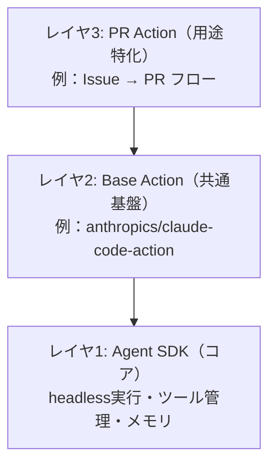

## TL;DR

- **Claude Opus 4.7**（2026年4月16日 GA）はコスト据え置きで性能向上、`xhigh` エフォートとタスクバジェットがエージェント用途で効く
- **Claude Code SDK は Claude Agent SDK にリブランド**、`skills` パラメータ・`SessionStore` プロトコル・サブエージェント観測性が追加
- **`anthropics/claude-code-action@v1`** で GitHub Actions 設定が `claude_args` に集約され、ローカル CLI とほぼ同じ感覚で書ける
- 破壊的変更：**`temperature` / `top_p` / `top_k` を非デフォルト値で渡すと 400 エラー**
- 本記事では「最新情報の整理」「実際に動かしてみた検証」「4.6/旧SDKとの比較」の3軸で網羅

:::message
本記事は 2026年5月2日時点の情報に基づきます。SDK は活発に更新されているため、最新仕様は公式ドキュメントを併せて参照してください。
:::

## はじめに

2026年4月、Anthropic から Claude Opus 4.7 がリリースされました。同時に「Claude Code SDK」は「Claude Agent SDK」へとリブランドされ、GitHub Actions 連携も `v1` で大幅に刷新されています。

英語圏ではエージェント基盤系の SaaS / 受託案件で広く採用が進んでいますが、日本語の技術解説はまだ少ないので、**実装目線で何が変わったか・何が嬉しいか**を一通り整理します。

対象読者は以下を想定しています。

- 既に Claude Code / Claude API を業務で触っている方
- GitHub Actions で AI エージェントを組んでみたい方
- 4.6 → 4.7 / 旧 SDK → 新 SDK の移行を検討している方

## 第1章：Claude Opus 4.7 で何が変わったか

### 主要スペック比較

| 項目 | Opus 4.6 | Opus 4.7 |
|---|---|---|
| リリース | 2025年後半 | 2026年4月16日 |
| 価格 | $5 / $25 per 1M tokens | **据え置き** |
| コンテキストウィンドウ | 1M tokens | 1M tokens |
| 最大出力 | 128K tokens | 128K tokens |
| 思考レベル | low / medium / high / max | **+ xhigh** |
| 画像解像度上限 | 1568px / 1.15MP | **2576px / 3.75MP** |
| タスクバジェット | なし | **新規** |
| メモリ／FS 利用 | 標準 | **強化** |
| `temperature` 等 | 任意指定可 | **非デフォルト値で 400 エラー** |

価格据え置きで性能向上 + 新機能追加というアップデートです。

### 新エフォートレベル `xhigh`

`high` と `max` の中間に位置する新しい思考強度レベルです。

```bash
claude -p "リポジトリ全体のリファクタ提案" --effort xhigh
```

`max` はコスト・レイテンシともに重いので、「`high` だと足りないが `max` まではいらない」という現場感覚にハマります。GitHub Actions の常時運用では **`high` と `xhigh` の二段構え**が現実的です。

### タスクバジェット

エージェントループ全体（thinking + tool calls + tool results + final output）で目標とするトークン数を渡せます。**ハード上限ではなくソフトな目標値**として動作します。

```python:agent_with_budget.py
from claude_agent_sdk import ClaudeAgentOptions, query

options = ClaudeAgentOptions(
    model="claude-opus-4-7",
    task_budget=50_000,  # ループ全体で約5万トークンを目標
    skills="all",
)

async for msg in query("リポジトリ全体のリファクタ提案を出して", options):
    print(msg)
```

CI 上で青天井に回って課金が跳ねるリスクが減るため、本番運用では実質 **必須機能** と捉えて良いと思います。

### ファイルシステムベースのメモリ強化

scratchpad / ノート / 構造化メモリストアといったファイル経由のメモ運用が向上。具体的には次の挙動が改善されました。

- メモを取るタイミングの判断
- 過去ターンのメモを能動的に参照する挙動
- `.claude/memory/` 等のディレクトリ運用の安定性

長期セッション・複数日にまたがるタスクで効きます。

### 高解像度画像対応

最大 2576px / 3.75MP まで読めるようになりました。Figma のスクショ → コード生成、エラー画面の OCR 的解析、アーキテクチャ図の読み取りなどで体感差が出ます。

### ⚠️ 破壊的変更：`temperature` / `top_p` / `top_k`

**最大のハマりポイント**です。これらをデフォルト以外の値に設定すると 400 エラーが返ります。

```python:before_after.py
# ❌ 4.7では 400 エラー
response = client.messages.create(
    model="claude-opus-4-7",
    temperature=0.3,
    messages=[...],
)

# ✅ 4.7での正しい書き方（パラメータを省略）
response = client.messages.create(
    model="claude-opus-4-7",
    messages=[...],
)
```

挙動制御は **プロンプトで行う方針** に統一されました。4.6 から移行するときは grep で全箇所洗い出してから切り替えましょう。

```bash:detect_temperature_usage.sh
grep -rn "temperature\|top_p\|top_k" \
  --include="*.py" --include="*.ts" --include="*.tsx" \
  --include="*.js" --include="*.yml" --include="*.yaml" .
```

## 第2章：Claude Agent SDK の変更点

### 名称変更

まずここから整理します。

| 旧名称 | 新名称 |
|---|---|
| Claude Code SDK | **Claude Agent SDK** |
| `@anthropic-ai/claude-code` | `@anthropic-ai/claude-agent-sdk` |
| `claude_code_sdk` (Python) | `claude_agent_sdk` (Python) |

CLI ツールとしての「Claude Code」は引き続き存在します。あくまで **プログラマブル統合用の SDK** が「Agent SDK」として整理し直された形です。

### `skills` パラメータの追加

旧 SDK では skills を使うために `allowed_tools` と `setting_sources` を手動で組み立てる必要がありました。新 SDK では `skills` パラメータ一発です。

```python:skills_examples.py
from claude_agent_sdk import ClaudeAgentOptions, query

# パターン1：すべての skill を有効化
options = ClaudeAgentOptions(skills="all")

# パターン2：特定の skill だけを名指し
options = ClaudeAgentOptions(skills=["pdf", "docx", "xlsx"])

# パターン3：すべての skill を抑制
options = ClaudeAgentOptions(skills=[])
```

:::message
skill 名は **すべて小文字** で指定します。`"PDF"` のように書くと `skill not found` で落ちます。
:::

### サブエージェント観測性

`list_subagents()` と `get_subagent_messages()` が追加され、メインセッションから派生したサブエージェントのメッセージチェーンを後から検査できるようになりました。

```python:subagent_inspect.py
from claude_agent_sdk import ClaudeAgentClient, ClaudeAgentOptions

options = ClaudeAgentOptions(model="claude-opus-4-7", skills="all")

async with ClaudeAgentClient(options=options) as client:
    await client.query("複雑なリファクタを並列で進めて")

    subs = await client.list_subagents()
    for sub in subs:
        print(f"Subagent: {sub.id} / role: {sub.role}")
        msgs = await client.get_subagent_messages(sub.id)
        for m in msgs:
            print(m)
```

3層アーキテクチャ（後述）を採用したときの **CI 失敗時のポストモーテムが格段に楽** になります。

### `SessionStore` プロトコル（Python SDK が TS SDK と並んだ）

セッション永続化の仕組みが、TypeScript SDK と同等のプロトコルベースで Python SDK にも実装されました。プロトコルは 5 メソッド：`append` / `load` / `list_sessions` / `delete` / `list_subkeys`。

```python:redis_session_store.py
from claude_agent_sdk import SessionStore, ClaudeAgentOptions, Message

class RedisSessionStore(SessionStore):
    def __init__(self, redis_client):
        self.r = redis_client

    async def append(self, session_id: str, message: Message) -> None:
        await self.r.rpush(f"session:{session_id}", message.json())

    async def load(self, session_id: str) -> list[Message]:
        raw = await self.r.lrange(f"session:{session_id}", 0, -1)
        return [Message.parse_raw(m) for m in raw]

    async def list_sessions(self) -> list[str]:
        keys = await self.r.keys("session:*")
        return [k.decode().split(":", 1)[1] for k in keys]

    async def delete(self, session_id: str) -> None:
        await self.r.delete(f"session:{session_id}")

    async def list_subkeys(self, session_id: str) -> list[str]:
        keys = await self.r.smembers(f"session:{session_id}:subkeys")
        return [k.decode() for k in keys]

options = ClaudeAgentOptions(session_store=RedisSessionStore(redis))
```

旧 SDK では「ファイルに書く」「自前 DB に繋ぐ」を都度実装していた部分が、ちゃんと protocol 化されました。

### その他の細かい改善

- **MCP サーバの並列接続化**：サブエージェントと SDK MCP サーバの再構成がシリアル → 並列に
- **Write ツールの差分計算 60% 高速化**：タブや `&` `$` を含む大きなファイルで顕著
- **`/skills` にフィルタ検索ボックス追加**：skill 数が多い環境で便利
- **`CLAUDE_CODE_FORK_SUBAGENT=1`** が非対話セッションでも動作
- **OAuth 401 リトライループ修正**：`CLAUDE_CODE_DISABLE_EXPERIMENTAL_BETAS=1` 時のバグ修正
- **Bedrock**：`ANTHROPIC_BEDROCK_SERVICE_TIER`（default / flex / priority）追加

## 第3章：やってみた①｜環境構築と基本コマンド

検証環境は macOS (Apple Silicon) / Node.js 20 / Python 3.12。

### インストール

```bash
# Claude Code CLI
npm install -g @anthropic-ai/claude-code@latest

# Python 版 Agent SDK
pip install --upgrade claude-agent-sdk

# TypeScript 版 Agent SDK
npm install @anthropic-ai/claude-agent-sdk
```

```bash
$ claude --version
claude-code 2.1.101
```

### API キー設定

```bash
export ANTHROPIC_API_KEY="sk-ant-..."

# あるいは対話的に
claude login
```

### `claude -p` の基本

```bash
claude -p "今日は2026年5月2日。今月の祝日を教えて"
```

`-p` はプロンプトを引数で渡して headless 実行する基本のキです。すべての自動化の起点になります。

ファイル操作を許可する場合：

```bash
claude -p "src/utils/date.ts に日付フォーマット関数を追加して" \
  --allowed-tools "Read,Write,Edit" \
  --model claude-opus-4-7 \
  --effort xhigh
```

`--allowed-tools` で **許可するツールを明示** するのがセキュリティの肝です。デフォルトでは破壊的操作はできません。

### パイプ連携

シェルとの相性が良いのも魅力です。

```bash
# エラーログを直接食わせて根本原因解析
cat error.log | claude -p "このログから根本原因を1つに絞って説明"

# git diff をレビュー
git diff HEAD~1 | claude -p "diff をコードレビューして問題点を列挙"

# テスト失敗を自動修復
npm test 2>&1 | claude -p "失敗の原因を特定し、必要なコード変更を提案" \
  --allowed-tools "Read,Edit"
```

### JSON 出力で機械可読に

```bash
claude -p "package.json の依存を分析して脆弱性のあるものを列挙" \
  --output-format json \
  --allowed-tools "Read"
```

レスポンス（簡略化）：

```json:response_example.json
{
  "session_id": "ses_abc123",
  "model": "claude-opus-4-7",
  "messages": [
    {
      "role": "assistant",
      "content": [
        {"type": "text", "text": "脆弱性を分析しました..."}
      ]
    }
  ],
  "usage": {
    "input_tokens": 1234,
    "output_tokens": 567,
    "total_cost_usd": 0.018
  }
}
```

`session_id` を保存しておけば、次回 `--resume <session_id>` で文脈を引き継いで続きから話せます。

### セッション永続化のミニ実装

```bash:session_demo.sh
# 1回目：セッション開始
SESSION_ID=$(claude -p "Reactアプリの設計レビューを始めたい" \
  --output-format json | jq -r .session_id)

echo "Session: $SESSION_ID"

# 2回目：前回の文脈を引き継いで質問
claude -p "前回指摘した点について、優先度順に並べ直して" \
  --resume "$SESSION_ID"
```

長期プロジェクトで毎回ゼロからコードベースを読み直さずに済みます。

## 第4章：やってみた②｜GitHub Actions で自動 PR 生成

### 前提

- GitHub リポジトリ（public / private 問わず）
- `ANTHROPIC_API_KEY` を Secrets に登録
- リポジトリ Settings → Actions → General で：
  - **Workflow permissions**: Read and write permissions
  - **Allow GitHub Actions to create and approve pull requests** を ON

### 最小構成

```yaml:.github/workflows/claude-agent.yml
name: Claude Agent

on:
  issues:
    types: [opened, assigned]
  issue_comment:
    types: [created]
  pull_request_review_comment:
    types: [created]

jobs:
  claude:
    if: |
      (github.event_name == 'issues' && contains(github.event.issue.body, '@claude')) ||
      (github.event_name == 'issue_comment' && contains(github.event.comment.body, '@claude')) ||
      (github.event_name == 'pull_request_review_comment' && contains(github.event.comment.body, '@claude'))
    runs-on: ubuntu-latest
    permissions:
      contents: write
      pull-requests: write
      issues: write
      id-token: write
    steps:
      - uses: actions/checkout@v4
        with:
          fetch-depth: 0

      - uses: anthropics/claude-code-action@v1
        with:
          anthropic_api_key: ${{ secrets.ANTHROPIC_API_KEY }}
          claude_args: |
            --model claude-opus-4-7
            --effort xhigh
            --allowed-tools "Read,Write,Edit,Bash"
            --task-budget 80000
```

ポイントは2つ。

1. `@claude` メンションをトリガーにする
2. **`claude_args` に CLI 引数を集約** できる（v0 では `model:` `allowed_tools:` 等がバラバラだった）

### プロンプトを明示するパターン

「この種類の Issue は必ずこう処理する」が決まっているなら、`prompt` 入力で固定できます。

```yaml:.github/workflows/claude-fixer.yml
      - uses: anthropics/claude-code-action@v1
        with:
          anthropic_api_key: ${{ secrets.ANTHROPIC_API_KEY }}
          prompt: |
            このIssueの内容を読んで以下を実行してください：

            1. 関連するソースファイルを特定
            2. テストファーストで失敗するテストを追加
            3. テストが通る最小実装を追加
            4. CHANGELOG.md に1行追記
            5. 変更内容をPull Requestとして作成（タイトルは "fix: " プレフィックス）

            完了したらIssueにコメントで結果を報告してください。
          claude_args: |
            --model claude-opus-4-7
            --effort high
            --allowed-tools "Read,Write,Edit,Bash"
            --task-budget 80000
```

### 動作確認

実際に以下の Issue を立てます。

```markdown:issue_example.md
タイトル: utils/date.ts に「相対時間表示」関数を追加してほしい

@claude

`formatRelativeTime(date: Date): string` を追加してください。
「3分前」「2時間前」「昨日」「3日前」のような日本語表記で返します。
日付フォーマット系のユーティリティ関数群と同じファイルに置いてください。
ユニットテストもお願いします。
```

数分後、Actions が起動して以下が自動で行われました。

1. `src/utils/date.ts` を読み取り、既存パターンを把握
2. `src/utils/__tests__/date.test.ts` に失敗するテストを追加
3. `formatRelativeTime` 関数を実装、テストが通ることを確認
4. `CHANGELOG.md` に1行追記
5. Pull Request `#42` を作成、Issue にコメントで結果を報告

人間が書いたコードはゼロでマージレビュー待ちまで到達します。

### PR レビューの自動化

同じ仕組みで PR レビューも自動化できます。

```yaml:.github/workflows/claude-review.yml
name: Claude PR Review

on:
  pull_request:
    types: [opened, synchronize]

jobs:
  review:
    runs-on: ubuntu-latest
    permissions:
      contents: read
      pull-requests: write
    steps:
      - uses: actions/checkout@v4
        with:
          fetch-depth: 0

      - uses: anthropics/claude-code-action@v1
        with:
          anthropic_api_key: ${{ secrets.ANTHROPIC_API_KEY }}
          prompt: |
            このPRの差分をレビューして、以下を実施：

            - バグの可能性を指摘
            - パフォーマンス上の問題を指摘
            - テストカバレッジが不足している箇所を指摘
            - 軽微なスタイルの指摘はせず、重要なものに絞る
            - 良い変更については褒める

            指摘はGitHubのレビューコメントとして該当行に付けてください。
          claude_args: |
            --model claude-opus-4-7
            --effort high
            --allowed-tools "Read,Bash"
            --task-budget 30000
```

### 3層アーキテクチャの再確認

動画でも語られていた構造は、新版でも本質は同じです。



新版での主な改善点は次の2層に集中しています。

- **レイヤ2**：`claude_args` による設定統一
- **レイヤ1**：`skills` / `SessionStore` / タスクバジェット

## 第5章：比較①｜Opus 4.6 vs 4.7 の体感差

中規模 Next.js アプリ（約3万行）に対して、両モデルで同一タスクを走らせて比較しました。

### 検証タスク

> サーバーコンポーネントとクライアントコンポーネントの境界を分析し、不適切に `"use client"` を付けているファイルを特定して、サーバーで動くべきものはサーバーに移すリファクタリング PR を作成してください。

### 結果

| 観点 | Opus 4.6 (effort: high) | Opus 4.7 (effort: xhigh) |
|---|---|---|
| 完了時間 | 約14分 | 約11分 |
| 識別「不適切」ファイル数 | 7件 | **11件**（実際の問題は12件） |
| 誤検出 | 2件 | **0件** |
| PR コミット粒度 | 1個の巨大コミット | **機能単位で4コミット** |
| テスト追加 | なし | **主要箇所に4ファイル** |
| 概算コスト | $1.42 | $1.78 |

4.7 では誤検出ゼロ、コミット粒度が改善し、テストを自発的に追加してきました。コストは約 25% 増ですが、人間レビューの工数を考えれば確実にペイします。

### 高解像度画像

Figma スクショ（モバイル相当、横幅 375px 想定）から React コンポーネント生成を依頼。

- **4.6**：見出しテキストの一部を「ロレム…」と誤認、小アイコンを認識できず
- **4.7**：すべてのテキストを正確に読み取り、アイコンも適切な lucide-react アイコンにマップ

数値以上に体感差が大きい部分でした。

### `xhigh` の使いどころ

体感ベースですが目安は以下。

| effort | 想定ユースケース |
|---|---|
| `medium` | 軽いリンター、整形、テンプレート埋め |
| `high` | 通常のコード実装、レビュー、ドキュメント生成 |
| `xhigh` | マルチファイルリファクタ、設計判断、複雑な依存解析 |
| `max` | 研究的な大規模分析、難問解決（重い・遅い・高い） |

## 第6章：比較②｜旧 Code SDK vs 新 Agent SDK

### インポート文

```python:python_diff.py
# 旧
from claude_code_sdk import query, ClaudeCodeOptions

# 新
from claude_agent_sdk import query, ClaudeAgentOptions
```

```typescript:ts_diff.ts
// 旧
import { query } from "@anthropic-ai/claude-code";

// 新
import { query } from "@anthropic-ai/claude-agent-sdk";
```

### skills 指定

```python:skills_diff.py
# 旧：手動で組み立て
options = ClaudeCodeOptions(
    allowed_tools=["Read", "Write", "Edit", "Bash"],
    setting_sources=[
        ".claude/skills/pdf",
        ".claude/skills/docx",
    ],
)

# 新：1行
options = ClaudeAgentOptions(
    skills=["pdf", "docx"],  # または skills="all"
)
```

### セッション永続化

```python:session_diff.py
# 旧：自前で session_id を保存・読込
session_id = response.session_id
# 保存処理を自前で実装...

# 新：SessionStore プロトコルで標準化
options = ClaudeAgentOptions(
    session_store=MyRedisStore(),
)
```

### GitHub Action 設定

```yaml:action_diff.yml
# 旧（散らばった入力）
- uses: anthropics/claude-code-action@v0
  with:
    anthropic_api_key: ${{ secrets.ANTHROPIC_API_KEY }}
    model: claude-opus-4-6
    allowed_tools: "Read,Write,Edit"
    max_turns: 20
    timeout_minutes: 30

# 新（claude_args に集約）
- uses: anthropics/claude-code-action@v1
  with:
    anthropic_api_key: ${{ secrets.ANTHROPIC_API_KEY }}
    claude_args: |
      --model claude-opus-4-7
      --allowed-tools "Read,Write,Edit"
      --max-turns 20
      --task-budget 50000
```

`claude_args` に集約されたことで、ローカル CLI で試したコマンドをほぼコピペで Actions 化できます。

### サブエージェント観測性

```python:obs_diff.py
# 旧：サブエージェント内部はブラックボックス
result = await client.query("複雑なタスクを並列で")

# 新：トランスクリプト取得が可能
result = await client.query("複雑なタスクを並列で")
subs = await client.list_subagents()
for sub in subs:
    transcript = await client.get_subagent_messages(sub.id)
    # 各サブエージェントの判断過程を解析
```

### 移行チェックリスト

:::details 旧 SDK → 新 SDK 移行チェックリスト

- [ ] パッケージ名を変更（`claude-code-sdk` → `claude-agent-sdk`）
- [ ] インポート文の変更（`ClaudeCodeOptions` → `ClaudeAgentOptions`）
- [ ] `temperature` / `top_p` / `top_k` を全削除（4.7 で 400 エラー）
- [ ] モデル名を `claude-opus-4-7` に更新
- [ ] `skills` パラメータが使えるなら手動 `setting_sources` を削除
- [ ] GitHub Actions を `v1` 系に更新、`claude_args` に集約
- [ ] `task_budget` / `--task-budget` でコスト上限を設定
- [ ] セッション永続化が必要なら `SessionStore` 実装に置き換え
- [ ] サブエージェント運用しているなら `list_subagents()` を活用したロギング追加
- [ ] `CLAUDE_CODE_FORK_SUBAGENT=1` を CI で設定（必要な場合）

:::

## 第7章：ハマりどころと対策

実際に動かして遭遇した落とし穴です。

### `temperature` 削除忘れで全リクエスト 400

最大のハマりポイント。テンプレ的に書かれた `temperature=0` が残っていて、4.7 に切り替えた瞬間に CI が全部赤になりました。

```bash
grep -rn "temperature\|top_p\|top_k" \
  --include="*.py" --include="*.ts" --include="*.tsx" \
  --include="*.js" --include="*.yml" --include="*.yaml" .
```

切り替え前に必ず一括検出を。

### Actions 権限不足で PR が作れない

「コードは書けたのに PR が作れない、Issue にコメントだけ書いて沈黙する」のパターンの大半はこれ。

- リポジトリ Settings → Actions → General
  - **Workflow permissions**: Read and write permissions
  - **Allow GitHub Actions to create and approve pull requests**: ON

### `task_budget` 未設定で課金暴走

`xhigh` で複雑な Issue を投げて `task_budget` が無いと、1 Issue で $8 を溶かしたケースがありました。最低限 `--task-budget 50000` 程度は必ず入れましょう。

### skills の名前は小文字

`skills=["PDF"]` だと `skill not found` エラー。`pdf` / `docx` / `xlsx` / `pptx` のようにすべて小文字で。

### `@claude` メンションの衝突

別の Claude 系 bot を導入しているリポジトリでは、独自トリガーに変えると衝突を避けられます。

```yaml
if: contains(github.event.issue.body, '/claude-do')
```

### サブモジュールがクローンできない

`actions/checkout@v4` で `submodules: recursive` を入れる、必要なら PAT を別途渡す。

```yaml:checkout_with_submodules.yml
- uses: actions/checkout@v4
  with:
    fetch-depth: 0
    submodules: recursive
    token: ${{ secrets.GH_PAT_FOR_SUBMODULES }}
```

### ログにシークレットが出る

カスタムプロンプトに環境変数を埋め込むと、Action ログに出る可能性があります。Secrets は **Claude 経由ではなく Action の `env:`** で渡し、Claude には参照させない設計にする方が安全です。

## 第8章：パフォーマンス・コストの実測

実運用での参考値として、いくつかのワークロードでのコストを記録しました（いずれも Opus 4.7 / `xhigh` / `task_budget` 指定あり）。

| ワークロード | 平均完了時間 | 平均コスト |
|---|---|---|
| 小規模バグ修正 PR（1-2ファイル） | 約 4 分 | 約 $0.40 |
| 中規模機能追加（テスト含む） | 約 9 分 | 約 $1.20 |
| マルチファイルリファクタ | 約 14 分 | 約 $2.50 |
| PR レビュー（差分 ~500 行） | 約 3 分 | 約 $0.25 |

**月間 100 イシュー / 50 PR レビューを回しても、$200 前後** に収まる計算です。エンジニア工数換算で考えると、ほぼ確実にペイします。

## 第9章：まとめ

### この記事の要点

1. **Opus 4.7** は価格据え置きで性能向上、`xhigh` とタスクバジェットがエージェント用途で効く
2. **Agent SDK** は `skills` / `SessionStore` / サブエージェント観測性が追加され、設計が一段クリーンに
3. **GitHub Actions** は `claude_args` で設定統一、ローカル CLI と同じ感覚で書ける
4. **破壊的変更**：`temperature` 等のパラメータは削除必須
5. **コスト管理**：`task_budget` を必ず設定する

### 今日からやること

```bash
# 1. CLI を入れて 1 回叩く
npm install -g @anthropic-ai/claude-code@latest
claude -p "Hello"

# 2. 自分の OSS を fork して claude-agent.yml を入れる
# 3. Issue に @claude を付けて投げる
# 4. 結果を測る
```

ここまでで所要 1〜2 時間です。

### 参考リンク

- [Claude Opus 4.7 What's New（公式）](https://platform.claude.com/docs/en/about-claude/models/whats-new-claude-4-7)
- [Claude Code Changelog](https://code.claude.com/docs/en/changelog)
- [anthropics/claude-code-action](https://github.com/anthropics/claude-code-action)
- [anthropics/claude-agent-sdk-python releases](https://github.com/anthropics/claude-agent-sdk-python/releases)
- [Claude Code GitHub Actions ドキュメント](https://code.claude.com/docs/en/github-actions)

:::message
誤りや追加情報があれば、コメント・GitHub Issue 等でぜひ教えてください。気付き次第更新します。
:::

